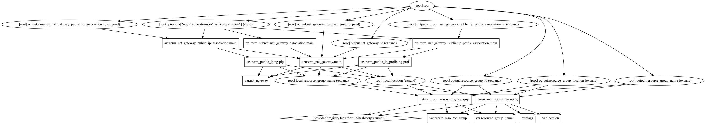

# Azure NAT Gateway Terraform Module

Virtual Network NAT (network address translation) simplifies outbound-only Internet connectivity for virtual networks. When configured on a subnet, all outbound connectivity uses your specified static public IP addresses. Outbound connectivity is possible without load balancer or public IP addresses directly attached to virtual machines.

This terraform module quickly deploys azure NAT Gateway instance with the assiociation with Public IP, Public IP prefix and with a Subnet within a Virtual Network.

> NAT is regional by default. When creating availability zones scenarios, NAT can be isolated in a specific zone (zonal deployment).

## Module Usage

```hcl
# Azurerm Provider configuration
provider "azurerm" {
  features {}
}

module "nat-gateway" {
  source  = "kumarvna/nat-gateway/azurerm"
  version = "1.0.0"

  # By default, this module will not create a resource group. Location will be same as existing RG.
  # proivde a name to use an existing resource group, specify the existing resource group name, 
  # set the argument to `create_resource_group = true` to create new resrouce group.
  #   # The Subnet must have the name `AzureFirewallSubnet` and the subnet mask must be at least a /26
  resource_group_name = "rg-shared-westeurope-01"
  location            = "westeurope"

  # Azure NAT Gateway and associated public IP, ip-prefix, subnets specificationscount
  # Regional or zone isolation with availability zones is supported
  nat_gateway = {
    testnatgateway-zone1 = {
      availability_zone       = ["1"]
      public_ip_prefix_length = 30
      idle_timeout_in_minutes = 10
      subnet_id               = var.subnet_id
    },
    testnatgateway-zone2 = {
      availability_zone       = ["2"]
      public_ip_prefix_length = 30
      idle_timeout_in_minutes = 10
      subnet_id               = var.subnet_id
    }
  }

  # Adding TAG's to your Azure resources 
  tags = {
    ProjectName  = "demo-internal"
    Env          = "dev"
    Owner        = "user@example.com"
    BusinessUnit = "CORP"
    ServiceClass = "Gold"
  }
}

```

## **`nat_gateway`** - NAT gateway configuration

This object to help set up the various settings for Azure NAT Gateway and supports following arguments.

| Argument | Description |
|--|--|
`public_ip_prefix_length`|Specifies the number of bits of the prefix. The value can be set between `0` (4,294,967,296 addresses) and `31` (2 addresses). Defaults to 30 (2 addresses).
`idle_timeout_in_minutes`|The idle timeout which should be used in minutes. Defaults to `4`.
`availability_zone`|A list of availability zones where the NAT Gateway, public ip and Public IP prefix should be provisioned.
`subnet_id`|The ID of the Subnet within a Virtual Network

## Limitations

- NAT is compatible with standard SKU public IP, public IP prefix, and load balancer resources. Basic resources, such as basic load balancer, and any products derived from them aren't compatible with NAT. Basic resources must be placed on a subnet not configured with NAT.
- IPv4 address family is supported. NAT doesn't interact with IPv6 address family. NAT can't be deployed on a subnet with an IPv6 prefix.
- NAT can't span multiple virtual networks.

## Recommended naming and tagging conventions

Applying tags to your Azure resources, resource groups, and subscriptions to logically organize them into a taxonomy. Each tag consists of a name and a value pair. For example, you can apply the name `Environment` and the value `Production` to all the resources in production.
For recommendations on how to implement a tagging strategy, see Resource naming and tagging decision guide.

>**Important** :
Tag names are case-insensitive for operations. A tag with a tag name, regardless of the casing, is updated or retrieved. However, the resource provider might keep the casing you provide for the tag name. You'll see that casing in cost reports. **Tag values are case-sensitive.**

An effective naming convention assembles resource names by using important resource information as parts of a resource's name. For example, using these [recommended naming conventions](https://docs.microsoft.com/en-us/azure/cloud-adoption-framework/ready/azure-best-practices/naming-and-tagging#example-names), a public IP resource for a production SharePoint workload is named like this: `pip-sharepoint-prod-westus-001`.

## Requirements

| Name | Version |
|------|---------|
| terraform | >= 0.13 |
| azurerm | >= 2.59.0 |

## Providers

| Name | Version |
|------|---------|
| azurerm | >= 2.59.0 |

## Inputs

Name | Description | Type | Default
---- | ----------- | ---- | -------
`create_resource_group` | Whether to create resource group and use it for all networking resources | string | `"false"`
`resource_group_name`|The name of an existing resource group.|string|`""`
`location`|The location for all resources while creating a new resource group.|string|`""`
`nat_gateway`|Manages Azure NAT Gateway also associated public IP, ip-prefix and subnets|map(object({}))|`{}`
`Tags`|A map of tags to add to all resources|map|`{}`

## Outputs

|Name | Description|
|---- | -----------|
`resource_group_name`| The name of the resource group in which resources are created
`resource_group_id`| The id of the resource group in which resources are created
`resource_group_location`| The location of the resource group in which resources are created
`nat_gateway_id`|The ID of the NAT Gateway
`nat_gateway_resource_guid`|The resource GUID property of the NAT Gateway
`azurerm_nat_gateway_public_ip_association_id`|The (Terraform specific) ID of the Association between the Nat Gateway and the Public IP.
`azurerm_nat_gateway_public_ip_prefix_association_id`|The (Terraform specific) ID of the Association between the Nat Gateway and the Public IP Prefix.

## Resource Graph



## Authors

Originally created by [Kumaraswamy Vithanala](mailto:kumarvna@gmail.com).

## Other resources

- [Azure NAT Gateway](https://docs.microsoft.com/en-us/azure/virtual-network/nat-gateway/)
- [Terraform AzureRM Provider Documentation](https://www.terraform.io/docs/providers/azurerm/index.html)
